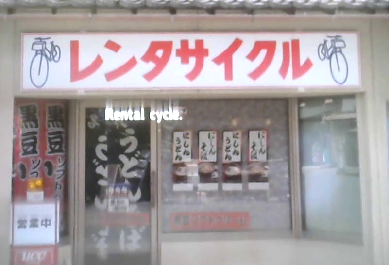
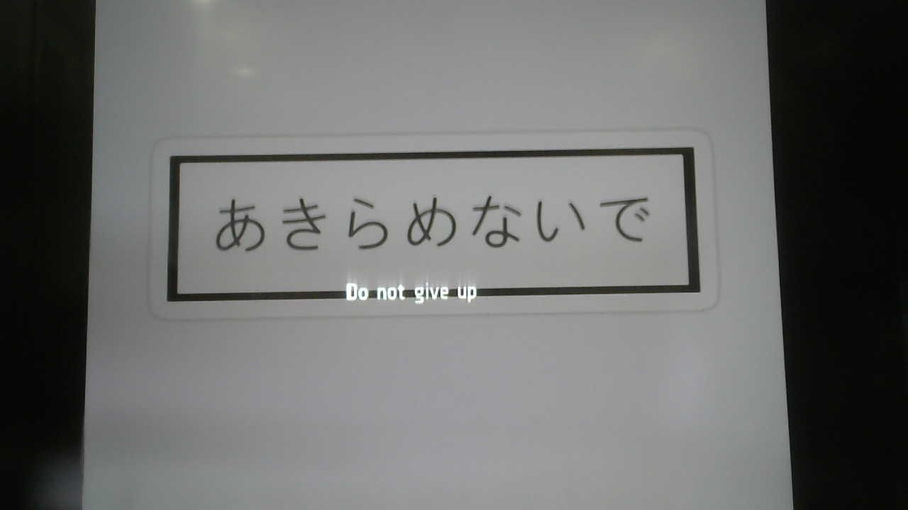
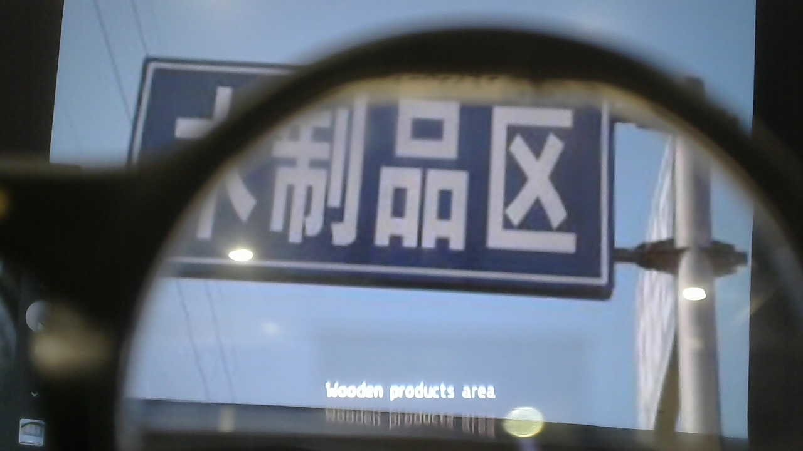
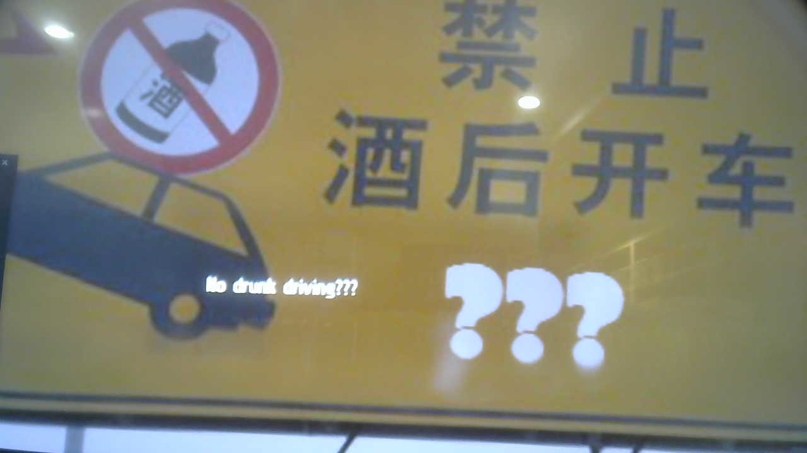
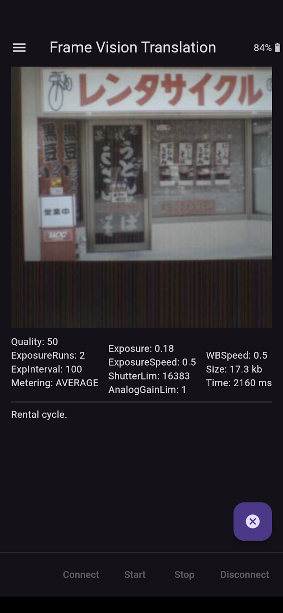
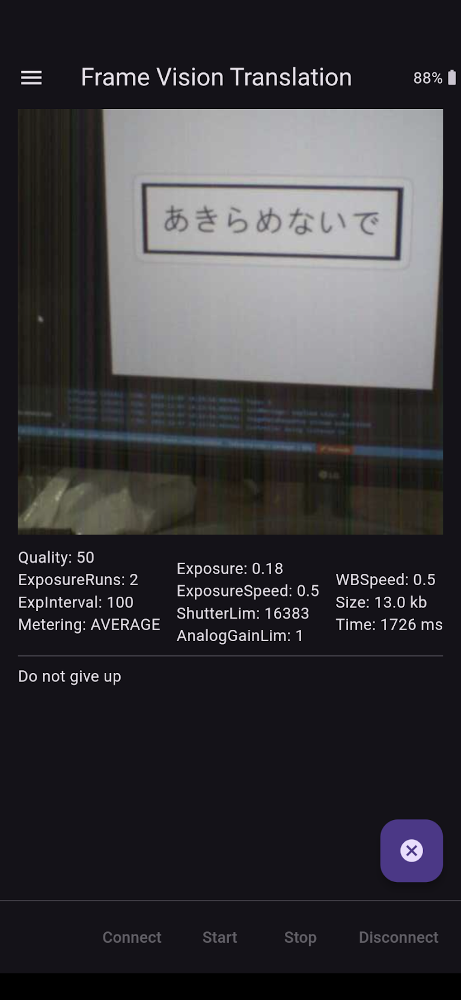
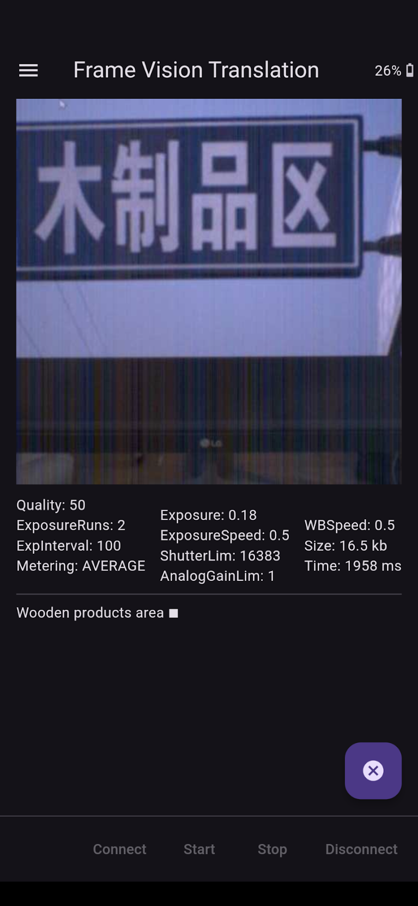
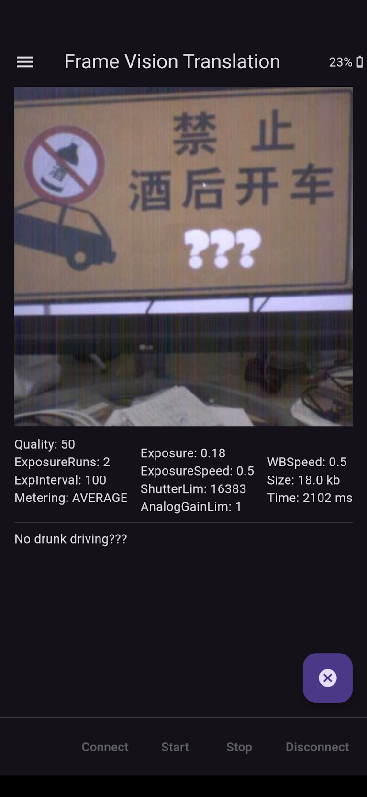

# Frame Vision Translation

Uses the Brilliant Labs Frame camera to take a picture that includes some text, uses Google ML Kit text recognition then translation to translate the text and display it on Frame

### Frameshots

### Framecast

### Screenshots

### Architecture
